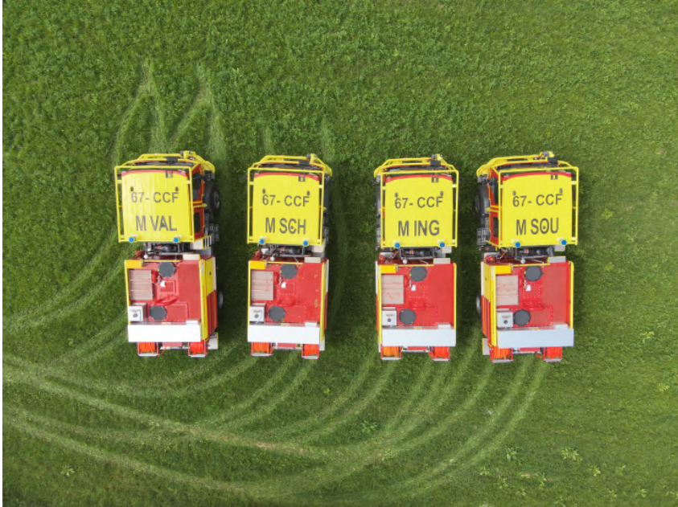
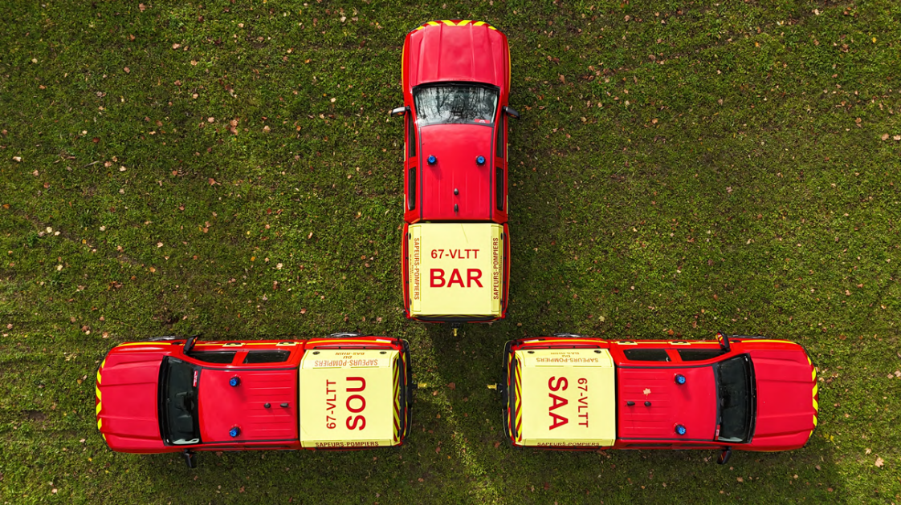
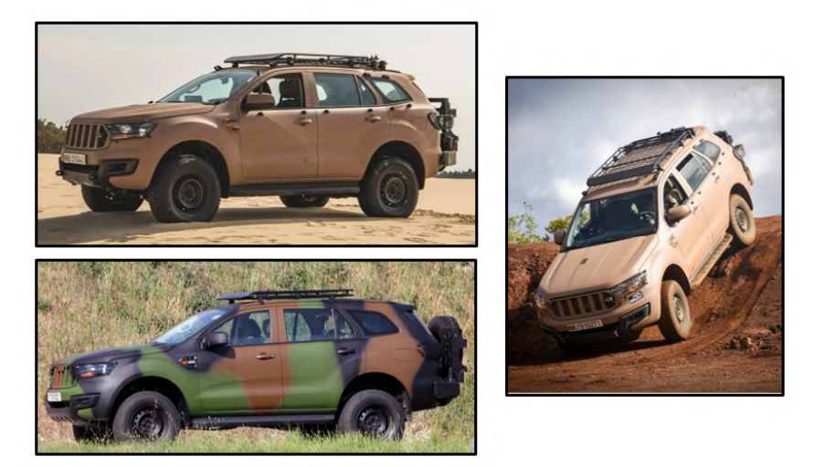
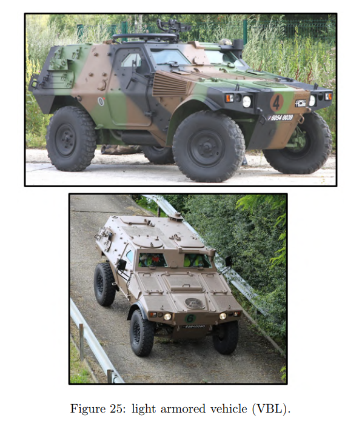
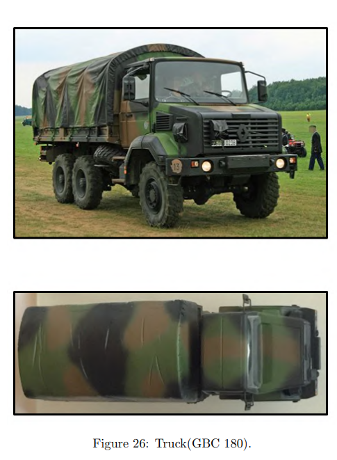

# vehicle_identification_IMAV_2026
Repo for detection and vehicle indentification algorithm for IMAV 2026 competition mission. 

### Mission description
Context: "In the context of a wildfire, having an accurate map of the operational area, including the location
of intervention teams, is essential. The objective of this mission is to generate a map of the area and
to identify both the position and the designation of the emergency vehicles deployed on the field."

__Important info__
- Within these areas, a number of fire brigade and military vehicles will be positioned (the exact
distribution between fire and military vehicles will be specified on the day of the competition). -> we know its 8 to detect but we do not know the split
- Points will be awarded if GPS positions are provided with an accuracy of within 5 meters and
if the vehicle will correctly be identified.
- The GPS coordinates must be provided no later than 5 minutes after landing.
- the table is required:

| Vehicle Identification | GPS coordinates                         |
|------------------------|-----------------------------------------|
| 67-CCF-M-ING           | 48.8095202082736 ; 7.85202741622925     |
| GBC                    | 180 48.8084886157098 ; 7.85187721252441 |

__Type of the vehicles__
1. Fire birgade trucks (CCF):

- red / yellow colors
- black lettered identifiers in yelllow or white bg 

2. VLTT: light off road

- mainly red
- yellow  or white bg / red letters with identifier

3. 4x4 VT4 

- different colors possible
- rather not red

4. VBL light armoured vehicle 

- rather military colors

5. Truck (GBC 180)

### Idea

Multi-phase algorithm for detection and differentiation. 
1. __Phase 1__

Light YOLO model like YOLO26n pretrained on vehicle dataset for detecting just vehicles. 
__Potential issue:__ if organizers are mean, they could park some random cars etc. to make it harder for correct detection. 

2. __Phase 2__

OpenCV check for colors in the bounding box from YOLO. If the red or yellow are detected than we assuem its firefighters' vehicle, otherwise its military.
The parameters for the check are to be adjusted through trial and error. 

3. __Phase 3__ 

We fly over a vehicle to get image diretly above.

4. __Phase 4__ 

We try to use OCR to decode the vehicle identification (in case of fire trucks and cars). Then we save the GPS position and the text of the OCR. In case of military vehicles we need to differentiate betweem three types. Here we will use geometry calculations to check the lenghts and heights and match on this basis the right type. 

### Military vehicles 
1. 4x4 VT4

Link to french government site with the description: https://www.defense.gouv.fr/terre/nos-materiels/nos-equipements-terre/vehicules-larmee-terre/vehicules-legers/vehicule-tactique-4x4

Dimensions:
- Length 5.3m
- Width 2.16m
- Height 2.06m

2. VBL

Link: https://en.wikipedia.org/wiki/V%C3%A9hicule_Blind%C3%A9_L%C3%A9ger, https://www.defense.gouv.fr/terre/nos-materiels/nos-equipements-terre/vehicules-larmee-terre/vehicules-reconnaissance/vbl-vehicule-blinde

Dimensions:
- Length 3.8m or 4.02m
- Width 2.02m
- Height 1.7m

3. GBC 180

Link https://www.defense.gouv.fr/terre/nos-materiels/nos-equipements-terre/vehicules-larmee-terre/vehicules-transports-troupes/gbc-180-vehicule

Dimensions:
- length 7.27m-8.25m
- width 2.49m
- height 2.92m - 3.57m

### Length/Height comparison

- VT4 : 2.454
- VBL : 1.88-1.99
- GBC 180 : 2.92-3.31

There is quite large difference between those vehicles so that is good. Important thing to note is how we will calculate this dimensions. We can taken bounding boxes from YOLO, but they are for sure a bit unprecise, other option is to use OpenCV and try to extract vehicle from the background but here the issue is that the military vehicles are camouflaged so it will be rather unreliable. Also we have to keep in mind that if the vehicle is set in the angle from the drone perspective and normal bouding boxes are not rotated to match that. We probably might use this: https://docs.ultralytics.com/tasks/obb 